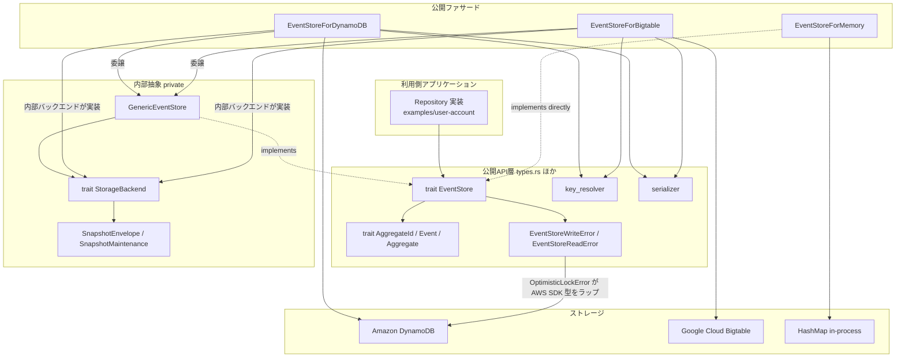
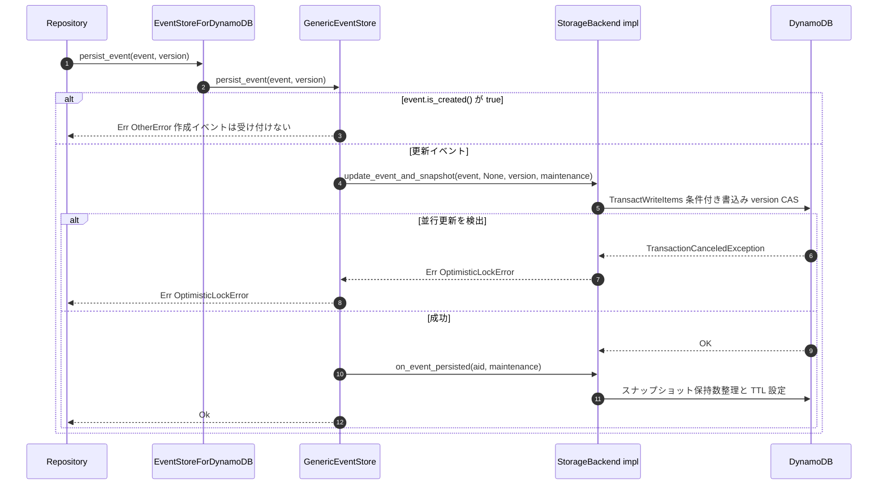
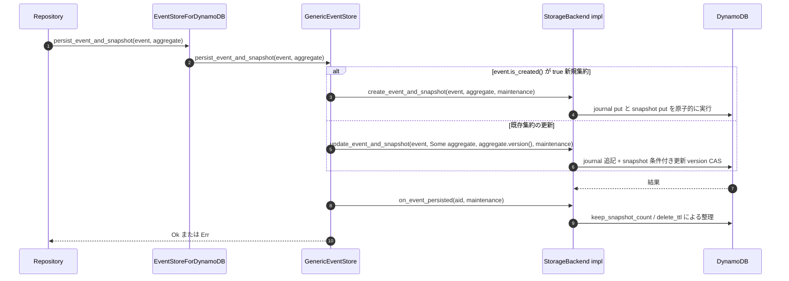
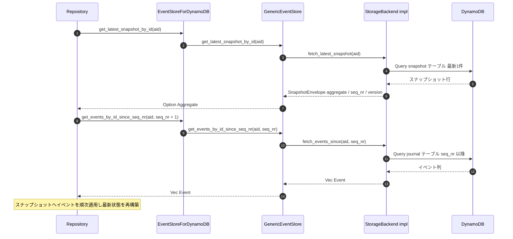

# アーキテクチャ — event-store-adapter-rs

## システム概要

CQRS / Event Sourcing 用イベントストアアダプタを提供するライブラリクレート。利用側アプリケーション（リポジトリ実装）は公開トレイト `EventStore` のみに依存し、その背後で DynamoDB / Bigtable / Memory の3バックエンドが Journal（イベント列）と Snapshot（集約状態）の2テーブル相当の永続化を担う。書込みは `version` ベースの楽観ロック、読出しは「最新スナップショット + 差分イベントリプレイ」が基本プロトコルである。

## アーキテクチャスタイル

**レイヤード + Ports & Adapters（ヘキサゴナル）風のライブラリ内部構造**。

- **ポート（公開契約）**: `EventStore` トレイトと `AggregateId` / `Event` / `Aggregate` ドメイントレイト（`types.rs`）。
- **内部ポート（private）**: `StorageBackend` トレイト（5メソッド）。バックエンドが満たすべき最小契約に絞られている。
- **共通ポリシー層（private）**: `GenericEventStore` が `StorageBackend` を `EventStore` に橋渡しし、`is_created()` 分岐・作成イベント拒否・`on_event_persisted` フック・maintenance 設定を一元化する。
- **アダプタ（公開ファサード）**: `EventStoreForDynamoDB` / `EventStoreForBigtable` は `GenericEventStore` への委譲で実装。**`EventStoreForMemory` だけは旧構造のまま `EventStore` を直接実装**しており、抽象に乗っていない。

証跡: `lib/src/lib.rs` のモジュール構成、`event_store_backend.rs` / `generic_event_store.rs` の private 宣言、各 `event_store_for_*.rs` の実装形態。

## コンポーネント関係

<!-- Text fallback: Repository は trait EventStore に依存する。GenericEventStore が EventStore を実装し、EventStoreForDynamoDB と EventStoreForBigtable はそれぞれ GenericEventStore へ委譲する（各々の内部バックエンド構造体が private trait StorageBackend を実装）。EventStoreForMemory だけは StorageBackend を経由せず EventStore を直接実装する旧構造。key_resolver / serializer は DynamoDB / Bigtable が共用。エラー型 EventStoreWriteError::OptimisticLockError は aws_sdk_dynamodb の TransactionCanceledException をラップしており、公開契約に AWS SDK がリークしている。 -->

## Interaction Diagrams

主要なビジネストランザクションが `EventStore` トレイト → `GenericEventStore` → `StorageBackend` → 具象バックエンドとどう流れるかを示す。図は DynamoDB を例にするが、Bigtable も同一経路（原子性の実現方法のみ異なる）。Memory は `GenericEventStore` を経由しない（旧構造）。

### persist_event（更新イベントの追記）

<!-- Text fallback: Repository が persist_event(event, version) を呼ぶと、ファサードは GenericEventStore に委譲する。event.is_created() が true なら Err(OtherError) で拒否。更新イベントなら StorageBackend::update_event_and_snapshot(event, None, version, maintenance) が呼ばれ、DynamoDB では TransactWriteItems の条件付き書込み（version CAS）になる。条件不成立なら TransactionCanceledException が OptimisticLockError として返る。成功時は on_event_persisted フックがスナップショット保持数整理・TTL 設定を行い、Ok が返る。 -->

### persist_event_and_snapshot（イベント + スナップショットの保存）

<!-- Text fallback: persist_event_and_snapshot(event, aggregate) は GenericEventStore で is_created() により分岐する。作成イベントなら StorageBackend::create_event_and_snapshot（DynamoDB では journal put と snapshot put を1トランザクションで実行）。既存集約なら update_event_and_snapshot(event, Some(aggregate), aggregate.version(), maintenance) で journal 追記と snapshot の条件付き更新（version CAS）。いずれも成功後に on_event_persisted フックが keep_snapshot_count / delete_ttl に基づく整理を行う。Bigtable は各ステップが別 RPC で原子性が弱い（TD-07）。 -->

### 読出しパス（スナップショット取得 + イベントリプレイ）

<!-- Text fallback: 読出しは2段階。まず get_latest_snapshot_by_id(aid) が StorageBackend::fetch_latest_snapshot 経由で snapshot テーブルから最新1件を取得し、SnapshotEnvelope から aggregate を取り出して Option<Aggregate> を返す。次に get_events_by_id_since_seq_nr(aid, snapshot.seq_nr + 1) が fetch_events_since 経由で journal テーブルからそれ以降のイベント列を取得する。Repository がスナップショットへイベントを順次適用して最新の集約状態を再構築する。 -->

## データフロー

1. **書込み**: ドメインイベント（+ スナップショット）→ serializer（JSON デフォルト）でバイト列化 → key_resolver がパーティションキーを `{type_name}-{hash%shard_count}` に解決 → journal / snapshot テーブルへ条件付き書込み。
2. **読出し**: snapshot テーブルから最新スナップショット → journal テーブルから差分イベント → デシリアライズ → 利用側でリプレイ適用。
3. **保守**: 書込み成功後の `on_event_persisted` フックが古いスナップショットの削除（keep_snapshot_count）と TTL 設定（delete_ttl）を行う（DynamoDB のみ）。

## 主要設計判断（観測された決定とトレードオフ）

| 決定 | 採用理由（推定含む） | 帰結 |
|---|---|---|
| `StorageBackend` + `GenericEventStore` の2層抽象 | バックエンド共通ポリシーの重複排除。新バックエンド追加を5メソッド実装に縮減 | DynamoDB / Bigtable は共通化済み。SQLite 追加はこの抽象に乗れば低コスト。一方 private のため外部拡張は不可 |
| 抽象を private に保つ | 公開 API 表面の最小化・後方互換の自由度確保 | クレート内追加は容易だが、`SnapshotMaintenance` の到達不能 pub という歪みを生んでいる（TD-04） |
| エラー型に `#[from] TransactionCanceledExceptionWrapper` | DynamoDB 専用時代の実装の簡便さ | 公開契約への AWS SDK リーク。feature 分割の最重要障害（TD-01） |
| Memory を旧構造のまま残置 | 移行コストの先送り | 契約非対称（panic! vs Err）とテスト欠落（TD-05） |
| version ベース楽観ロック（CAS） | ロックフリーで多言語ファミリーと同一モデル | DynamoDB は原子的だが、Bigtable は read→write 近似でレースウィンドウ（TD-07）。SQLite はトランザクションで DynamoDB 同等の原子性を確保すべき |
| テスト同居 + 共有シナリオ方式 | バックエンド間の振る舞い同値性を1シナリオで担保 | 新バックエンドの受入基準が既に存在（`exercise_user_account_flow`） |

## 改善機会（SQLite 追加への示唆）

追加自体は「`StorageBackend` 5メソッド実装 + `GenericEventStore` ラップ + `EventStoreForSqlite` 公開型」で既存パターンに乗る。コストの中心は周辺整備:

1. **(a) `types.rs` の AWS 型除去** — バックエンド中立な楽観ロックエラーへの再設計（破壊的変更になり得るため計画的に）。
2. **(b) 依存の feature 化** — `aws-*` / `tonic` / `googleapis-*` の optional 化と `lib.rs` グロブ再エクスポートへの `#[cfg(feature)]` ガード。未使用の aws-http は削除。
3. **(c) Memory の抽象準拠化** — StorageBackend 経由への移行と panic! の Err 化で契約を対称に。
4. **(d) CI の feature マトリクス** — feature 組合せごとのビルド・テスト、clippy / MSRV 検証の追加。
5. **(e) スキーマ自動作成の内蔵** — SQLite はライブラリ本体でテーブル自動作成を担う（DynamoDB は DDL が test-utils 側にある設計差分を踏襲しない）。Bigtable の原子性欠落を SQLite で繰り返さず、トランザクションで DynamoDB の原子的 CAS 契約に合わせる。
