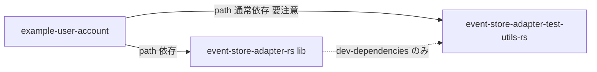

# 依存関係 — event-store-adapter-rs

## 内部パッケージ間依存

<!-- Text fallback: example-user-account は lib へ path 依存し、さらに test-utils へ「通常依存」している（本番向けサンプルがテストユーティリティに依存しており誤解を招く）。lib から test-utils へは dev-dependencies のみ（本番ビルドには入らない）。 -->

| 依存元 | 依存先 | 種別 | 評価 |
|---|---|---|---|
| example-user-account | lib | path・通常依存 | 正常 |
| example-user-account | test-utils | path・**通常依存** | 誤解を招く（TD-13）。テーブル作成 DDL が test-utils にあるため必要になっている |
| lib | test-utils | path・**dev のみ** | 正常（統合テスト用） |

バージョンはルート `Cargo.toml` の `[workspace.dependencies]` に一元化されており、各クレートは `workspace = true` で参照する。

## 外部依存の分類

- **無条件依存（lib）**: aws-sdk-dynamodb 1.23.0 / aws-config 1.2.1 / aws-http 0.60.5（未使用）/ tonic 0.14 / googleapis-tonic-google-bigtable-v2 0.39.0 / async-trait / thiserror / serde / serde_json / chrono / tracing。**バックエンドを1つも使わない利用者にも AWS SDK と gRPC スタック全体がリンクされる。**
- **dev・test-utils 限定**: testcontainers 0.28.0、googleapis-tonic-google-bigtable-admin-v2 0.45.0、tokio 1.37.0(full)、once_cell、ulid-generator-rs、anyhow、log。
- **宣言のみ未使用**: aws-http（lib）、serial_test 3.1.1、prost 0.14（TD-14）。

## feature 分割の障害となる無条件依存

SQLite バックエンド追加時に `dynamodb` / `bigtable` / `sqlite` の feature 分割を行う場合、以下が現状の障害である。

1. **`types.rs` の AWS SDK 型リーク（最重要 / TD-01)**: `EventStoreWriteError::OptimisticLockError(#[from] TransactionCanceledExceptionWrapper)` が `aws_sdk_dynamodb::types::error::TransactionCanceledException` を直接ラップする。エラー型は全バックエンド共通の公開契約なので、`aws-sdk-dynamodb` を optional にするにはバックエンド中立なエラー表現への再設計が必要（公開 enum のバリアント変更となり破壊的変更になり得る）。Memory / Bigtable も楽観ロック失敗時に `TransactionCanceledExceptionWrapper(None)` を返しており、意味的にも DynamoDB 用語が他バックエンドに漏れている。
2. **依存の optional 化未実施（TD-02)**: aws-config / aws-sdk-dynamodb / tonic / googleapis-tonic-google-bigtable-v2 のすべてが無条件。`optional = true` + feature 定義が必要。aws-http は未使用のため単純削除できる。
3. **`lib.rs` のグロブ再エクスポート（TD-03)**: `pub use event_store_for_dynamodb::*;` など3行が無条件で、モジュール宣言に `#[allow(dead_code)]` が付いている。feature 分割時は `#[cfg(feature = "...")]` ガードへの置換が必要。
4. **テスト・CI の分割未対応（TD-11)**: feature マトリクス（`--no-default-features` / 各 feature 単独）のビルド・テストが CI に存在しない。

## 依存更新管理

- Renovate が有効（`renovate.json`）。ワークスペース一元管理と組み合わさり、更新 PR はルート `Cargo.toml` に集約される。
- MSRV 宣言がないため、依存更新が最低サポートバージョンを黙って引き上げるリスクがある（`technology-stack.md` 参照）。
