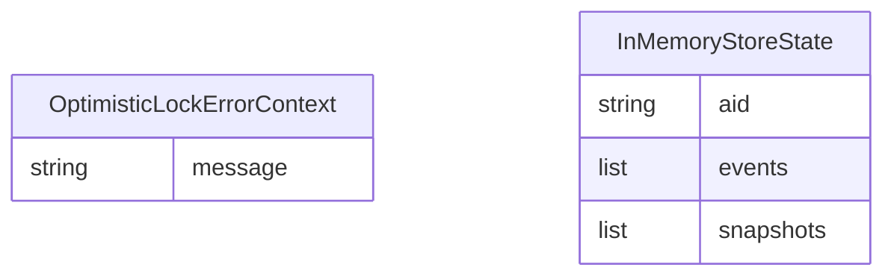

# 機能仕様 — u1-backend-features (functional-spec)

U1（バックエンドfeature分割と基盤整合）の振る舞い仕様。ワークフローと状態遷移の正本。エンティティ形状は `entities.md`、判定ロジックは `rules.md` が正本で、本書のER図・ルール要約は派生ビュー。上流: ユニット定義（`../../../inception/units-generation/unit-of-work.md`）・ストーリー対応（`../../../inception/units-generation/unit-of-work-story-map.md`）・要件（`../../../inception/requirements-analysis/requirements.md`）・コンポーネント（`../../../inception/domain-design/components.md`）・契約（`../../../inception/contract-design/contract-summary.md`）。

## ワークフロー1: エラー型中立化（US2.2）

1. `types.rs` から `TransactionCanceledExceptionWrapper` を削除し、`OptimisticLockError` を `String` コンテキスト保持のバリアントへ変更（BR1.2）
2. DynamoDBバックエンドのエラー写像を更新: SDKの TransactionCanceledException 検出時に整形文字列を生成して `OptimisticLockError` へ写像
3. Bigtable / Memory の楽観的ロック失敗経路も同一形式の整形文字列で写像（BR1.2の形式統一）。AC2.2.2のU1範囲の充足はMemory側のみで、sqlite側のランタイム検証はU2完了時に成立する（橋渡しAC）
4. エラーパス: 写像不能な下位エラーは既存どおり `IOError` / `OtherError` へ（panicしない — 構築フェーズ規範）

## ワークフロー2: feature分割（US2.1）

1. `Cargo.toml` に `[features]` を定義: `dynamodb` / `bigtable` / `sqlite`（器のみ — rusqlite依存とsqlite実装はU2）。デフォルトなし（契約C-3）
2. クラウドSDK依存（aws-sdk-dynamodb / aws-config / tonic / googleapis-tonic-google-bigtable-v2）を `optional = true` 化し対応featureに束ねる（BR1.3/BR1.4）
3. `lib.rs` のモジュール宣言・再エクスポートに `#[cfg(feature = ...)]` を付与し、`#[allow(dead_code)]` を除去（BR1.5）
4. 未使用依存（aws-http）・宣言のみ（prost）・未使用dev依存（serial_test）を削除（BR1.5）
5. テスト・test-utilsのfeature追随: DynamoDB/Bigtableのテストモジュールを対応featureでガードし、既存テストがfeature有効時に緑のまま（BR1.9）

## ワークフロー3: Memory準拠化（US3.1）

1. `event_store_for_memory.rs` を `StorageBackend` 実装＋`GenericEventStore` 委譲へ書き換え（BR1.6）
2. 内部状態を `InMemoryStoreState`（entities.md）の共有構造にし、Clone間の状態分岐を解消
3. 手書き `unsafe impl Send/Sync` を除去（BR1.7 — 3バックエンドの既存分を含むU1接触範囲）
4. 公開API `EventStoreForMemory::new()` は維持（BR1.8）

## 状態遷移: エラー写像の決定表

| 発生源 | 条件 | 写像先 |
|---|---|---|
| 条件付き更新失敗 | バージョン不一致 | `OptimisticLockError(String)`（BR1.2形式） |
| 直列化失敗 | serde エラー | `SerializationError` |
| I/O・接続失敗 | 下位ドライバ/SDKエラー | `IOError` |
| その他 | 上記以外 | `OtherError` |

## 派生ビュー: エンティティ関係（entities.md より導出）

<!-- Text fallback: U1のエンティティは独立した2型のみ（OptimisticLockErrorContext: message文字列 / InMemoryStoreState: aidキーとevents・snapshotsリスト）。相互関係なし。 -->

## 派生ビュー: ルール要約（rules.md より導出）

BR1.1〜BR1.9 の9件 — 型中立性（1.1/1.2）、featureビルド構成（1.3〜1.5）、Memory契約統一（1.6/1.7）、互換性保護（1.8/1.9）。

## Assumptions & Open Questions

None.
