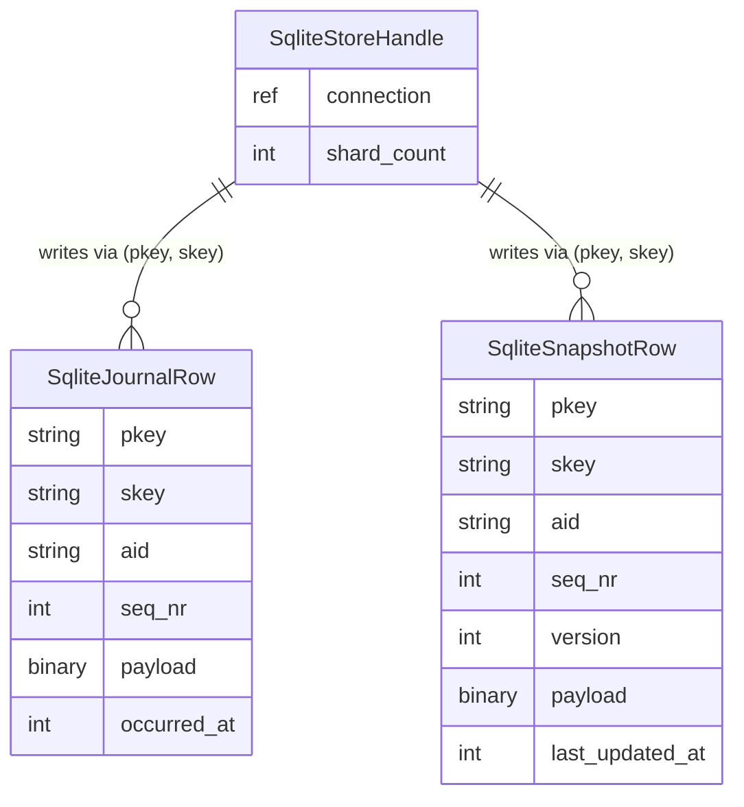

# 機能仕様 — u2-sqlite-backend (functional-spec)

U2（SQLiteバックエンド）の振る舞い仕様。ワークフローと状態遷移の正本。エンティティ形状は `entities.md`、判定ロジックは `rules.md` が正本で、本書のER図・ルール要約は派生ビュー。上流: ユニット定義（`../../../inception/units-generation/unit-of-work.md`）・ストーリー対応（`../../../inception/units-generation/unit-of-work-story-map.md`）・要件（`../../../inception/requirements-analysis/requirements.md`）・コンポーネント（`../../../inception/domain-design/components.md`）・契約（`../../../inception/contract-design/contract-summary.md`）。挙動は既存DynamoDBバックエンド（参照実装 — TransactWriteItemsによる**原子的CAS**）と対称とし、単一トランザクション内で完結するCASは**DynamoDBとの共通点**である（ADR-003のConsequencesが求める「DynamoDB契約との対称性」そのもの）。ADR-003が踏襲を拒否している非原子パターンは**Bigtable**のRead→Write2段階方式（TD-07）であり、SQLiteはこれを複製しない。DynamoDBとの実質的な差異は「ローカルファイル／`:memory:`」という接続先の性質のみ。

## ワークフロー1: 構築とスキーマ自動作成（US1.1）

1. `EventStoreForSqlite::new(path)` はファイルDBへの、`new_in_memory()` は `:memory:` への基底接続を確立する（確立失敗は panic せず中立エラー — BR2.8）
2. 接続確立時に journal / snapshot テーブルと読み込み索引 (aid, seq_nr) を不存在なら作成する（冪等 — BR2.1。利用者DDLなし）
3. `with_keep_snapshot_count` / `with_delete_ttl` / `with_key_resolver` / `with_event_serializer` / `with_snapshot_serializer` / シャード数設定は self 消費型ビルダーで構成する（契約C-1。KeyResolver は書き込み分散に実使用する — BR2.2）
4. `Clone` は基底接続を共有する（BR2.5 — `:memory:` のインスタンス単位共有と決定的競合テストの前提）

## ワークフロー2: 新規集約の永続化 create_event_and_snapshot（US1.1）

1. 接続ロックを取得し、単一トランザクションを開始する（BR2.6）
2. 現行スロット（skey = resolve_sort_key(aid, 0)）へスナップショット行を挿入する（version = aggregate.version()）。既存なら一意性違反 → BR1.2書式の `OptimisticLockError` へ写像しロールバック（BR2.3）
3. journal へイベント行を挿入する（(pkey, skey) 書き込みアドレス、(aid, seq_nr) 一意 — BR2.2）
4. keep_snapshot_count 設定時は履歴スナップショット行（skey = resolve_sort_key(aid, 実seq_nr)）も同一トランザクションで挿入する（DynamoDB参照実装と対称）
5. コミットする。失敗は決定表どおり写像（BR2.8）

## ワークフロー3: 既存集約の更新 update_event_and_snapshot（US1.2）

1. 接続ロックを取得し、単一トランザクションを開始する（BR2.4/BR2.6 — 判定と書き込みが原子的〔AC1.2.2〕）
2. 現行スロット行を `version = expected_version` の条件付きで `expected_version + 1` へ更新する（aggregate 有りなら payload / seq_nr / last_updated_at も更新、無しなら version / last_updated_at のみ — DynamoDB参照実装と対称）
3. 影響行が0なら実 version を読み取り、`optimistic lock failed, aid=<id>, expected_version=<n>, actual_version=<m>` 書式の `OptimisticLockError` を返しロールバックする（BR2.4 — U1確定書式）
4. journal へイベント行を挿入し、keep_snapshot_count 設定時は履歴行も挿入する
5. コミットする

## ワークフロー4: 読み出し（US1.1 / US1.3）

1. `fetch_latest_snapshot(aid)`: 現行スロット行を読み、payload を復元して `SnapshotEnvelope`（集約＋version＋seq_nr）を返す。不存在は `None`
2. `fetch_events_since(aid, seq_nr)`: 読み込み索引 (aid, seq_nr) で `seq_nr >= 指定値` のイベントを昇順に取得し復元する（BR2.2 — 読み込みは aid/seq_nr キー）
3. `GenericEventStore` がスナップショット＋イベントリプレイで最新状態を再構成する（AC1.1.2）

## ワークフロー5: 保守 on_event_persisted（US1.4）

1. keep_snapshot_count 未設定なら何もしない
2. 設定時: 履歴行（現行スロット以外）の件数が保持数を超えた分の古い行を削除する。delete_ttl 設定時は期限切れ履歴行も削除する（BR2.7 — 設定は実際に効く、現行スロット行は対象外）

## 状態遷移: versionとスロットの決定表

| 操作 | 前提状態 | 成功後 | 失敗条件 → 結果 |
|---|---|---|---|
| create | スロット0行なし | スロット0行（version=初期値）＋journal 1行 | スロット0行あり → `OptimisticLockError`（BR2.3） |
| update | スロット0行の version == expected | version = expected+1、journal 追記 | version != expected → 実versionを付加した `OptimisticLockError`（BR2.4） |
| 読み出し | 任意 | 状態変化なし | I/O失敗 → `IOError` 系（BR2.8） |

## 派生ビュー: エンティティ関係（entities.md より導出）



<!-- Text fallback: SqliteStoreHandle（共有接続＋shard_count）が、(pkey, skey) を書き込みアドレスとして SqliteJournalRow（イベント行）と SqliteSnapshotRow（スナップショット行 — スロット0=現行/version保持、履歴行=実seq_nr）を書き込む。読み込みは両テーブルとも (aid, seq_nr) 索引。 -->

## 派生ビュー: ルール要約（rules.md より導出）

BR2.1〜BR2.12 の12件 — スキーマ自動作成（2.1）、書き込み分散/読み込みキー（2.2）、作成一意性・CAS（2.3/2.4）、:memory: 共有（2.5）、同期実行（2.6）、保持ポリシー（2.7）、エラー写像（2.8）、リンク方式（2.9）、依存制約（2.10）、実装経路（2.11）、テスト規範（2.12）。

## Assumptions & Open Questions

None.

## Review

**Verdict:** READY
**Reviewer:** aidlc-architecture-reviewer-agent
**Date:** 2026-08-23T02:23:21Z
**Iteration:** 2

### Findings

新規Critical/Major/Minor所見なし。

### Previous Findings — Resolution Check

| # | Severity | Iteration 1 Finding | Status |
|---|---|---|---|
| 1 | Major | functional-spec.md冒頭文が「単一トランザクション内で完結するCAS」をDynamoDBとの差異として位置づけていたが、ADR-003本文（DynamoDB契約との対称性）および実コード（`transact_write_items()`使用）の両方と正反対だった | 解消済み — 冒頭文が「単一トランザクション内で完結するCASはDynamoDBとの共通点（ADR-003のConsequencesが求める『DynamoDB契約との対称性』そのもの）」「ADR-003が踏襲を拒否している非原子パターンはBigtableのRead→Write2段階方式（TD-07）」「DynamoDBとの実質的な差異はローカルファイル／`:memory:`のみ」に書き換えられ、ADR-003本文・実DynamoDB実装（`transact_write_items`）の両方と整合する記述になった。 |

iteration 1のValidation Tool Resultsで傍証として記録した「entities.mdの列構成（event_id省略・created_at→last_updated_at改称）が契約C-4から無断乖離しており未開示」という点についても、entities.md冒頭（3行目）に「C-4の暫定スケッチからの乖離はさらに2点あり、ここで明示的に開示する」として2点とも明示的に開示され、実DynamoDB参照実装との対称性を優先した判断であることが記載された。これはブロッキングな所見ではなかったが、開示の追加は文書の透明性を高めるものであり歓迎する。

### Validation Tool Results

| Tool/確認 | 結果 | 解釈 |
|---|---|---|
| functional-spec.md冒頭文とADR-003本文（`inception/domain-design/decisions.md`）の再突合 | PASS | 修正後の文言（DynamoDBとの共通点／Bigtable TD-07が棄却対象／差異はローカルファイル・`:memory:`のみ）がADR-003のContext/Consequencesと完全に整合する。 |
| entities.md冒頭の新規開示文とC-4の再突合 | PASS | event_id省略・created_at→last_updated_at改称の2点が明示的に開示され、実DynamoDB実装（`lib/src/event_store_for_dynamodb.rs`）との対称性を理由として記載されている。 |
| rules.md / traceability.json のバイト同一性確認 | PASS | iteration 1でレビューした内容と現行内容が同一であることを再読で確認した（今回の修正範囲外）。 |
| entities.md/rules.mdの```yamlブロック・traceability.jsonの再パース検証 | PASS | 構文エラーなし（iteration 1と同様）。 |

### Summary

iteration 1で指摘したMajor 1件は、根拠として引用するADR-003本文と実DynamoDB実装（`transact_write_items`によるTransactWriteItems原子的CAS）の両方に整合する形で正しく修正されました。加えて、ブロッキングではなかったentities.mdの列構成に関する開示不足も自主的に解消されています。rules.md・traceability.jsonは変更範囲外で、iteration 1時点の健全性がそのまま維持されています。Critical 0件・Major 0件・Minor 0件のためREADYと判定します。
