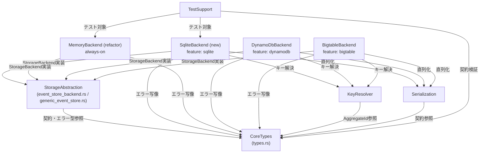

# コンポーネントカタログ: SQLite対応EventStoreとバックエンドfeature分割

要件定義書（`../requirements-analysis/requirements.md`）とストーリー（`../user-stories/stories.md`）を、既存アーキテクチャ（`aidlc/spaces/default/codekb/sqlite/architecture.md`、コンポーネント目録 `aidlc/spaces/default/codekb/sqlite/component-inventory.md`）の上に写像した論理構成要素のカタログ。チームプラクティス（`../practices-discovery/team-practices.md`）のレイヤ境界規約（新バックエンドは StorageBackend + GenericEventStore 経由）を設計不変条件とする。設計判断はQ&A（`domain-design-questions.md`）で確定済み。

## Machine-readable catalogue

```yaml
components:
  - name: CoreTypes
    summary: 公開トレイト（EventStore / AggregateId / Event / Aggregate）とバックエンド中立なエラー型を定義する契約の中核
    behaviour: >
      公開API契約の唯一の定義点。エラー型再設計（FR-2.4）で
      OptimisticLockError を軽量コンテキスト付き（集約ID・期待バージョン等の
      文字列情報を保持）の中立バリアントへ変更し、AWS SDK型への依存
      （TransactionCanceledExceptionWrapper）を除去する。トレイトシグネチャは
      不変更（NFR-1）。
    responsibilities:
      - EventStore トレイト契約の定義
      - ドメイン契約（AggregateId / Event / Aggregate）の定義
      - EventStoreWriteError / EventStoreReadError の定義（バックエンド中立）
    depends_on: []
    dependents:
      - component: StorageAbstraction
        interaction: トレイト境界・エラー型を参照
      - component: DynamoDbBackend
        interaction: エラー型への写像・トレイト実装
      - component: BigtableBackend
        interaction: エラー型への写像・トレイト実装
      - component: SqliteBackend
        interaction: エラー型への写像・トレイト実装
      - component: MemoryBackend
        interaction: エラー型への写像・トレイト実装
      - component: KeyResolver
        interaction: AggregateId を参照
      - component: Serialization
        interaction: Event / Aggregate 契約を参照
      - component: TestSupport
        interaction: 契約準拠テストで参照
    external_dependencies: []
    entities: []

  - name: StorageAbstraction
    summary: 内部抽象 StorageBackend（5メソッド）と GenericEventStore 委譲実装
    behaviour: >
      バックエンド共通の制御フロー（is_created分岐・作成イベント拒否・
      on_event_persisted フック）を一元化。SnapshotEnvelope /
      SnapshotMaintenance を定義。今回の変更で4バックエンドすべてが
      この経路に乗る（Memoryの準拠化 FR-3.1 を含む）。
    responsibilities:
      - StorageBackend トレイト（fetch_latest_snapshot / fetch_events_since / create_event_and_snapshot / update_event_and_snapshot / on_event_persisted）の定義
      - GenericEventStore による EventStore への橋渡し
      - SnapshotMaintenance（保持数・TTL）の設定モデル
    depends_on:
      - component: CoreTypes
        interaction: トレイト契約・エラー型を参照
        style: sync
    dependents:
      - component: DynamoDbBackend
        interaction: StorageBackend 実装・GenericEventStore ラップ
      - component: BigtableBackend
        interaction: StorageBackend 実装・GenericEventStore ラップ
      - component: SqliteBackend
        interaction: StorageBackend 実装・GenericEventStore ラップ
      - component: MemoryBackend
        interaction: StorageBackend 実装・GenericEventStore ラップ（今回準拠化）
    external_dependencies: []
    entities: []

  - name: SqliteBackend
    summary: 新規のSQLiteバックエンド（feature `sqlite`、公開型 EventStoreForSqlite）
    behaviour: >
      rusqlite（spawn_blockingによる非同期分離）でjournal/snapshotテーブルを
      操作する。初回利用時のスキーマ自動作成（FR-1.4）、単一トランザクション
      での楽観的ロックCAS（FR-1.3、Bigtableの非原子方式は踏襲しない）、
      ファイル/`:memory:` 両対応（FR-1.5、共有範囲はストアインスタンス単位）、
      スナップショット保持ポリシー実装（FR-1.6、サイレント無効禁止）。
      panic禁止・unsafe impl複製禁止（FR-3.3 / NFR-4）。
    responsibilities:
      - SQLiteスキーマ（journal / snapshot）の定義と自動作成
      - StorageBackend 5メソッドのSQLite実装
      - 保持ポリシー（keep_snapshot_count / delete_ttl）の適用
      - 公開ファサード EventStoreForSqlite（new + with_* ビルダー）
    depends_on:
      - component: CoreTypes
        interaction: エラー型への写像
        style: sync
      - component: StorageAbstraction
        interaction: StorageBackend 実装・GenericEventStore ラップ
        style: sync
      - component: KeyResolver
        interaction: パーティション/ソートキー解決（既存バックエンドとの一貫性）
        style: sync
      - component: Serialization
        interaction: イベント/スナップショットの直列化
        style: sync
    dependents:
      - component: TestSupport
        interaction: 共有シナリオ・競合パステストのテスト対象
    external_dependencies:
      - name: rusqlite
        kind: other
        purpose: SQLiteドライバ（唯一の追加依存。bundled/システムリンク両featureを提供）
    entities:
      - name: SqliteJournalRow
        identifier: (aid, seq_nr)
        attributes: [aid, seq_nr, event_id, payload, occurred_at]
        references: []
      - name: SqliteSnapshotRow
        identifier: (aid, seq_nr)
        attributes: [aid, seq_nr, version, payload, created_at]
        references: []

  - name: MemoryBackend
    summary: 常時有効のインメモリバックエンド（今回 StorageBackend 準拠へリファクタ）
    behaviour: >
      HashMapベースの格納を StorageBackend 実装に載せ替え、GenericEventStore
      経由で EventStore を提供する（FR-3.1）。作成イベントの persist_event
      渡しは panic ではなく Err（他バックエンドと同一契約）。手書きの
      unsafe impl Send/Sync は除去し自動導出に任せる。
    responsibilities:
      - StorageBackend のインメモリ実装
      - 公開ファサード EventStoreForMemory（new のみ、公開APIは維持）
    depends_on:
      - component: CoreTypes
        interaction: エラー型への写像
        style: sync
      - component: StorageAbstraction
        interaction: StorageBackend 実装・GenericEventStore ラップ
        style: sync
    dependents:
      - component: TestSupport
        interaction: 共有シナリオ・契約統一テストのテスト対象
    external_dependencies: []
    entities:
      - name: InMemoryStoreState
        identifier: aid
        attributes: [events, snapshots]
        references: []

  - name: DynamoDbBackend
    summary: 既存のDynamoDBバックエンド（feature `dynamodb` へ隔離）
    behaviour: >
      既存実装を維持しつつ feature `dynamodb` 配下へ移し、エラー写像を
      中立エラー型へ更新する。TransactWriteItems による原子的CASは
      参照実装として不変。
    responsibilities:
      - StorageBackend のDynamoDB実装（既存）
      - 公開ファサード EventStoreForDynamoDB（既存API維持）
    depends_on:
      - component: CoreTypes
        interaction: エラー型への写像（中立型へ更新）
        style: sync
      - component: StorageAbstraction
        interaction: StorageBackend 実装・GenericEventStore ラップ（既存）
        style: sync
      - component: KeyResolver
        interaction: キー解決（既存）
        style: sync
      - component: Serialization
        interaction: 直列化（既存）
        style: sync
    dependents: []
    external_dependencies:
      - name: aws-sdk-dynamodb / aws-config
        kind: third-party-api
        purpose: DynamoDBアクセス（feature `dynamodb` 配下に隔離）
    entities:
      - name: DynamoJournalItem
        identifier: (pkey, skey)
        attributes: [pkey, skey, aid, seq_nr, payload, occurred_at]
        references: []
      - name: DynamoSnapshotItem
        identifier: (pkey, skey)
        attributes: [pkey, skey, aid, seq_nr, version, payload, ttl]
        references: []

  - name: BigtableBackend
    summary: 既存のBigtableバックエンド（feature `bigtable` へ隔離）
    behaviour: >
      既存実装を維持しつつ feature `bigtable` 配下へ移し、エラー写像を
      中立エラー型へ更新する。既知の非原子的楽観ロック（TD-07）と
      保持ポリシー未実装（TD-08）は今回のスコープでは現状維持
      （SQLiteはこの前例を踏襲しない）。
    responsibilities:
      - StorageBackend のBigtable実装（既存）
      - 公開ファサード EventStoreForBigtable（既存API維持）
    depends_on:
      - component: CoreTypes
        interaction: エラー型への写像（中立型へ更新）
        style: sync
      - component: StorageAbstraction
        interaction: StorageBackend 実装・GenericEventStore ラップ（既存）
        style: sync
      - component: KeyResolver
        interaction: キー解決（既存）
        style: sync
      - component: Serialization
        interaction: 直列化（既存）
        style: sync
    dependents: []
    external_dependencies:
      - name: tonic / googleapis-tonic-google-bigtable-v2
        kind: third-party-api
        purpose: Bigtable gRPCアクセス（feature `bigtable` 配下に隔離）
    entities:
      - name: BigtableJournalRow
        identifier: row_key
        attributes: [row_key, aid, seq_nr, payload, occurred_at]
        references: []
      - name: BigtableSnapshotRow
        identifier: row_key
        attributes: [row_key, aid, seq_nr, version, payload]
        references: []

  - name: KeyResolver
    summary: パーティション/ソートキー解決（既存・変更なし）
    behaviour: >
      KeyResolver トレイトと DefaultKeyResolver（type_name + hashによる
      シャード分散）。SQLiteでも既存バックエンドと同じキー体系を用いて
      一貫性を保つ。
    responsibilities:
      - resolve_partition_key / resolve_sort_key の契約と既定実装
    depends_on:
      - component: CoreTypes
        interaction: AggregateId を参照
        style: sync
    dependents:
      - component: DynamoDbBackend
        interaction: キー解決
      - component: BigtableBackend
        interaction: キー解決
      - component: SqliteBackend
        interaction: キー解決
    external_dependencies: []
    entities: []

  - name: Serialization
    summary: イベント/スナップショットの直列化（既存・変更なし）
    behaviour: >
      EventSerializer / SnapshotSerializer トレイトとJSON既定実装。
      全バックエンドが共用。
    responsibilities:
      - 直列化契約と既定JSON実装
    depends_on:
      - component: CoreTypes
        interaction: Event / Aggregate 契約を参照
        style: sync
    dependents:
      - component: DynamoDbBackend
        interaction: 直列化
      - component: BigtableBackend
        interaction: 直列化
      - component: SqliteBackend
        interaction: 直列化
    external_dependencies: []
    entities: []

  - name: TestSupport
    summary: 共有テストシナリオとテストユーティリティ（既存＋SQLite対応拡張）
    behaviour: >
      共有シナリオ exercise_user_account_flow に SQLite / Memory を乗せ、
      競合パス・エラー契約テストを追加する（FR-4.1 / FR-4.2）。SQLiteテストは
      Docker不要（FR-4.3）。test-utils クレートは既存のDynamoDB/Bigtable
      コンテナ起動ヘルパーを維持。
    responsibilities:
      - 共有テストシナリオ（全バックエンド契約対称性の検証）
      - 競合パス・エラー契約テスト
    depends_on:
      - component: CoreTypes
        interaction: 契約準拠テスト
        style: sync
      - component: SqliteBackend
        interaction: テスト対象
        style: sync
      - component: MemoryBackend
        interaction: テスト対象
        style: sync
    dependents: []
    external_dependencies:
      - name: testcontainers
        kind: other
        purpose: 既存のDynamoDB/Bigtable統合テスト（devのみ。SQLiteでは不使用）
    entities: []
```

## Component Diagram



<!-- Text fallback: CoreTypes を中心に、StorageAbstraction が契約を参照し、4つのバックエンド（Sqlite新規/Memory準拠化/DynamoDB/Bigtable）がそれぞれ CoreTypes（エラー写像）と StorageAbstraction（StorageBackend実装）に依存する。Sqlite/DynamoDB/Bigtable は KeyResolver と Serialization も利用する。TestSupport は CoreTypes の契約検証として Sqlite/Memory をテスト対象とする。 -->

## Component Summary

| Component | Purpose | Depends On | Dependents | Entities Owned |
|---|---|---|---|---|
| CoreTypes | 公開契約・中立エラー型 | — | 全コンポーネント | — |
| StorageAbstraction | 内部抽象・委譲実装 | CoreTypes | 4バックエンド | — |
| SqliteBackend | SQLiteバックエンド（新規） | CoreTypes, StorageAbstraction, KeyResolver, Serialization | — | SqliteJournalRow, SqliteSnapshotRow |
| MemoryBackend | インメモリ（準拠化） | CoreTypes, StorageAbstraction | — | InMemoryStoreState |
| DynamoDbBackend | DynamoDB（feature隔離） | CoreTypes, StorageAbstraction, KeyResolver, Serialization | — | DynamoJournalItem, DynamoSnapshotItem |
| BigtableBackend | Bigtable（feature隔離） | CoreTypes, StorageAbstraction, KeyResolver, Serialization | — | BigtableJournalRow, BigtableSnapshotRow |
| KeyResolver | キー解決 | CoreTypes | 3バックエンド | — |
| Serialization | 直列化 | CoreTypes | 3バックエンド | — |
| TestSupport | 共有テスト | CoreTypes, SqliteBackend, MemoryBackend | — | — |

## Entity Ownership

| Entity | Owning Component | Identifier | Attributes | References |
|---|---|---|---|---|
| SqliteJournalRow | SqliteBackend | (aid, seq_nr) | aid, seq_nr, event_id, payload, occurred_at | — |
| SqliteSnapshotRow | SqliteBackend | (aid, seq_nr) | aid, seq_nr, version, payload, created_at | — |
| InMemoryStoreState | MemoryBackend | aid | events, snapshots | — |
| DynamoJournalItem | DynamoDbBackend | (pkey, skey) | pkey, skey, aid, seq_nr, payload, occurred_at | — |
| DynamoSnapshotItem | DynamoDbBackend | (pkey, skey) | pkey, skey, aid, seq_nr, version, payload, ttl | — |
| BigtableJournalRow | BigtableBackend | row_key | row_key, aid, seq_nr, payload, occurred_at | — |
| BigtableSnapshotRow | BigtableBackend | row_key | row_key, aid, seq_nr, version, payload | — |

## External Dependencies

| Component | Dependency | Kind | Purpose |
|---|---|---|---|
| SqliteBackend | rusqlite | other (DBドライバ) | SQLiteアクセス（bundled/system両feature） |
| DynamoDbBackend | aws-sdk-dynamodb / aws-config | third-party-api | DynamoDBアクセス（feature隔離） |
| BigtableBackend | tonic / googleapis-tonic-google-bigtable-v2 | third-party-api | Bigtable gRPC（feature隔離） |
| TestSupport | testcontainers | other | 既存統合テスト（devのみ） |

## Rationale

| Component | 分離理由 |
|---|---|
| CoreTypes | 公開契約は変更レートが最も低く、全コンポーネントの共有基盤（独立した関心事） |
| StorageAbstraction | バックエンド共通制御の一元化点。バックエンド追加時に変更しない安定層 |
| SqliteBackend | 新規featureの独立したライフサイクル・独立したデータ所有（journal/snapshotスキーマ） |
| MemoryBackend | 常時有効という独立した提供条件。今回の準拠化で他と同型に |
| DynamoDb/BigtableBackend | クラウドSDKという重い外部依存の隔離境界（featureゲート単位） |
| KeyResolver / Serialization | 複数バックエンドが共用する横断関心事（独立した変更理由） |
| TestSupport | テスト資産の共有点。プロダクトコードと独立した変更レート |

**分解の選択肢について**: 既存構成の踏襲（Q3=A）が確定しており、実質的な代替案は「バックエンドのディレクトリ再編」のみだった（差分最小を優先して棄却 — ADR-004参照）。他に有力な分解案はない。

## Assumptions & Open Questions

None.

## Review

**Verdict:** READY
**Reviewer:** aidlc-architecture-reviewer-agent
**Date:** 2026-08-22T13:35:09Z
**Iteration:** 2 (advisory — single pass; re-check after coordinator's symmetry fix)

### Findings

| # | Severity | Location | Finding | Recommendation |
|---|---|---|---|---|
| 1 | Resolved (was Major) | `components.md` YAML catalogue — `SqliteBackend.dependents` / `MemoryBackend.dependents` | 前回指摘した `depends_on`/`dependents` 対称性違反は解消を確認した。`SqliteBackend.dependents` と `MemoryBackend.dependents` にそれぞれ `{ component: TestSupport, interaction: ... }` が追加され、`TestSupport.depends_on` との逆参照が一致している。カタログ全体を再走査し、他の対（CoreTypes⇄各コンポーネント、StorageAbstraction⇄4バックエンド、KeyResolver/Serialization⇄3バックエンド）も含め対称性はすべて成立していることを確認した。 | 対応不要（解消済み）。 |
| 2 | Minor | `decisions.md` ADR-005 Consequences | 既存のコンポーネント目録（`component-inventory.md`）が明記する現行 Memory バックエンドの既知欠陥（`unsafe impl Send/Sync` 手書き・HashMap直持ちによる Clone 時状態分岐）の解消が、今回のリファクタで暗黙に必須となる点が ADR-005 に明示されていない。 | ADR-005 の Consequences に一文追加し、Clone 時状態分岐（既知欠陥）の解消が今回のスコープに含まれる旨を明記する。 |
| 3 | Minor | `components.md` SqliteBackend behaviour / ADR-002 | `:memory:` の共有範囲を「ストアインスタンス単位」とする決定と、`StorageBackend` トレイトの `Clone` 要求（Clone されたハンドルが同一DBを指す必要）との架橋点が ADR-002 に明示されていない。接続の並行制御自体は機能設計へ正しく先送りされているが、この前提だけは申し送りしておくとよい。 | ADR-002 か Rationale に一文「Clone されたバックエンドハンドルは同一接続（Arc等で共有）を指す設計とし、`:memory:` のインスタンス単位共有と整合させる」と明記する。 |

### Validation Tool Results

このステージに`validate-*`系の専用CLIツールは同梱されていないため、well-formedness ルールは手動でカタログ全体を再走査して検証した。

| Check | Result | Interpretation |
|---|---|---|
| コンポーネント名の一意性 | PASS | 9コンポーネントすべて名称重複なし |
| `depends_on`/`dependents` 対称性 | PASS（前回FAILから解消） | `TestSupport`⇄`SqliteBackend`/`MemoryBackend` を含め、全ペアで逆参照の対称性を確認 |
| 自己依存の禁止 | PASS | 自己参照なし |
| 依存グラフの非循環性 | PASS | `CoreTypes`を頂点とする有向非巡回グラフ、循環なし |
| エンティティの単一所有・identifier必須 | PASS | 7エンティティすべて単一コンポーネント所有・identifier定義あり |
| external_dependenciesがコンポーネント化されていないこと | PASS | rusqlite/aws-sdk-dynamodb/tonic/testcontainersはすべて`external_dependencies`扱い |
| traceability.json のUS網羅性 | PASS | `stories.md`の US1.1〜US4.2 全12件がupstream_idsに列挙・カバレッジ記載あり |
| ADR構造（Context/Decision/Consequences/Alternatives Rejected） | PASS | ADR-001〜005すべて4項目を具備 |

### Summary

前回指摘したMajor（`depends_on`/`dependents`対称性違反）は修正を確認し、解消済みとして扱う。カタログ全体を再走査した結果、他の well-formedness ルール（命名一意性・非循環性・エンティティ単一所有・external_dependenciesの非コンポーネント化）もすべてPASSし、`traceability.json`のストーリー網羅性・ADR構造も健全。残るのはMinor 2件（Memoryバックエンドの既知Clone欠陥の明示的な解消宣言、および`:memory:`共有範囲とClone要求の整合に関する申し送り）のみで、いずれも次工程（機能設計）への申し送りとして許容範囲。Critical該当なし、Major該当なしのためREADY判定とする。
